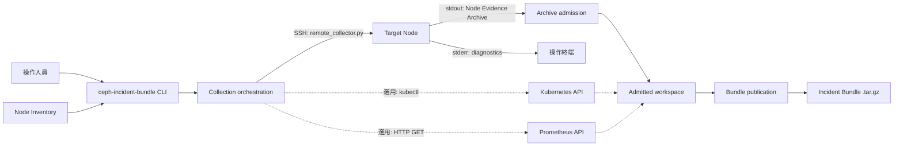

# 架構與模組介紹

## 系統角色、信任邊界與資料流

`ceph-incident-bundle` 由 Collection Workstation（執行收集的工作機）發起。操作人員在工作機準備 Node Inventory，明確列出要連線的 Target Node（目標節點），並可選擇一個節點執行 Ceph 查詢。Ceph、Kubernetes 與 Prometheus 都是選用來源：Inventory 沒有設定 `[ceph] source`、Kubernetes context 或 Prometheus URL 時，收集器不會收集該來源。

Collection Workstation 的作業系統、執行使用者、Inventory 作者，以及指定的 workspace 與 output parent，位於本機信任邊界內。從 SSH 收到的輸出與 Node Evidence Archive、Kubernetes response、Prometheus response 則一律視為不可信輸入。收集器不會根據 Ceph、Kubernetes 或其他觀測結果自動增加 Target Node；實際 SSH 範圍只由 Inventory 的 `[nodes]` 決定。



CLI 的主要 dispatch 位於 [`cli.main()`](../src/ceph_incident_bundle/cli.py)。`generate-inventory` 交給 [`generate_inventory.run()`](../src/ceph_incident_bundle/generate_inventory.py)，`collect` 則交給 [`collect.run()`](../src/ceph_incident_bundle/collect/__init__.py)。完整收集的主要呼叫順序如下：

```text
cli.main()
└─ collect.run()
   ├─ _validate_startup()
   │  └─ inventory.load_inventory()
   ├─ collect_node()                         # 每個 Target Node 一次
   │  ├─ _ssh_argv()
   │  ├─ system OpenSSH
   │  │  └─ remote_collector.main()          # 在 Target Node 暫時執行
   │  └─ node_archive.admit_archive()
   ├─ collect_kubernetes()                   # 設定 context 時執行
   ├─ collect_prometheus()                   # 設定 URL 時執行
   └─ bundle.publish_bundle()
```

每個 Target Node 使用一個 system OpenSSH process。工作機把完整的 `remote_collector.py` 經 SSH standard input 傳給遠端固定的 `python3 -`；Remote Node Collector 將 gzip-compressed Node Evidence Archive 寫到 standard output，診斷訊息則寫到 standard error。工作機完整接收 archive 後才開始結構驗證，不會直接信任或解壓遠端提供的 member。

收集期間的本機 workspace 分成兩類。`private` 保存尚未通過驗證的 archive、診斷資訊與來源暫存內容；`admitted` 只保存已通過各來源准入條件、可以交給發布模組的 contribution。Node、Kubernetes 與 Prometheus 的收集彼此獨立：單一來源或單一 Probe 失敗時，其他來源仍會繼續嘗試，已准入的 evidence 也會保留。

所有來源嘗試完成後，`publish_bundle()` 重新檢查 admitted workspace 的結構，把 Inventory Snapshot、各來源 contribution 與 collection metadata 寫入未公開的 archive candidate，嘗試清除本次 invocation 擁有的 workspace，再以不覆寫既有路徑的方式發布最終 `.tar.gz`。後續章節會分別說明 Inventory、各 collection module、archive admission、Bundle 結構，以及 complete、partial、cleanup 和中斷的詳細語意。

## `generate-inventory` 執行流程

`generate-inventory` 的目的是產生可供人工審查的 Inventory 草稿，不是探測 live cluster，也不會啟動收集。CLI options 由 `cli.main()` 定義：`--hosts-file` 預設 `/etc/hosts`、`--output` 預設 `inventory.ini`，`--force` 允許覆寫既有 output。

主要流程如下：

1. [`generate_inventory.run()`](../src/ceph_incident_bundle/generate_inventory.py) 解析 output path；未指定 `--force` 時，以 exclusive create 防止覆寫。
2. [`inventory.draft_inventory()`](../src/ceph_incident_bundle/inventory.py) 以 UTF-8 讀取 hosts file，移除 comment，接受有效 IPv4／IPv6 line 的第一個 hostname。
3. Loopback address、conventional local name、invalid hostname、zone-scoped address 與重複 hostname 不會進入草稿。
4. Hostname 的第一個 label 形成 `inventory_name`，完整 hostname 成為 `ssh_address`。名稱經 Unicode NFC normalization 與 case folding 後若 collision，草稿會加入 `ACTION REQUIRED` comment 並回報問題。
5. Hostname 包含 `mon`、`cp` 或 `cm` 時，第一個符合者會成為建議的 `[ceph] source`。這只是 naming heuristic，不代表工具已驗證該節點可以執行 Ceph command。
6. 草稿包含完整 section 與 default value；Kubernetes context 和 Prometheus URL 預設維持 comment，要求操作人員明確選擇。
7. 若有 collision，檔案仍會寫出供人工修改，但 command 回傳非零 status。沒有問題時回傳 0。

正式收集時不會信任 generator 的結果；`collect` 會重新呼叫 `load_inventory()` 完整驗證實際檔案。

## `collect` 執行流程

[`collect.run()`](../src/ceph_incident_bundle/collect/__init__.py) 是 workstation-side orchestration owner，完整流程分成 startup validation、source collection 與 publication。

### Startup validation

`_validate_startup()` 先執行所有可完成的檢查，再一次回報 problems：

- `load_inventory()` 讀取 byte-for-byte Inventory Snapshot，確認 UTF-8、section、key、duration、node name、SSH address、reference、namespace、regex 與 URL。
- `--since` 必須是正整數加 `m`、`h`、`d` 或 `w`，例如 `30m`、`24h`、`7d`。
- `--output-dir` 必須已存在、可 resolve，且是 ordinary directory。

任何 startup problem 都會在建立 workspace 與連線前停止，stderr 最後輸出 `FAIL: no Incident Bundle delivered`。

### Target Node collection

Startup 通過後，orchestrator 以 UTC whole-second timestamp 決定 final filename，建立 private temporary workspace 並保存 Inventory Snapshot。接著按 Inventory order 對每個 Target Node 呼叫 [`collect_node()`](../src/ceph_incident_bundle/collect/node.py)：

1. 建立 node-specific private staging。
2. `_ssh_argv()` 組成 `ssh -T -o BatchMode=yes`、選用 `ConnectTimeout`、固定 `root@ssh_address` 與 remote `python3 -` argument。
3. 將本地 `remote_collector.py` 作為 SSH stdin；完整 stdout 寫入 private archive file，stderr 寫入 diagnostics file，避免 pipe backpressure。
4. Remote Node Collector 在遠端建立 invocation-owned workspace，執行固定 Node Probe、選用的 Ceph Probe、copy selected regular file 與 log，然後 stream archive 並清除 workspace。
5. SSH streams 關閉後，工作機才把 diagnostics 安全呈現在 terminal，並呼叫 `admit_archive()`。
6. Archive 通過完整結構驗證才會 promote 成 admitted contribution。Remote exit 非零但 archive 結構有效時，仍保存 evidence，並把整次收集標成 partial。

單一 node 發生預期或非預期失敗都不會阻止下一個 node。未成功 admit archive 的 node 是 Skipped Node；最後 Bundle 只會透過 Inventory Snapshot 表示它曾在 scope 內，不會建立虛構的 node failure directory。

### Workstation-side optional sources

設定 Kubernetes context 時，orchestrator 呼叫 [`collect_kubernetes()`](../src/ceph_incident_bundle/collect/kubernetes.py)。它以明確 context／namespace 執行固定 `kubectl get`，解析 Pod list 只用來排程目前與 previous container log Probe；所有 command 都在 Collection Workstation 執行。

設定 Prometheus URL 時，orchestrator 呼叫 [`collect_prometheus()`](../src/ceph_incident_bundle/collect/prometheus.py)。它先保存 buildinfo、targets 與 job label response，再選出名稱含 `ceph` 或 `node` 的 job，查詢 metric name，套用 `metrics_filter_regex`，最後排程 range query。解析結果只控制後續 request；原始 response bytes 仍個別保存。

### Publication

所有來源嘗試結束後，problems 先安全輸出到 stderr，再呼叫 `publish_bundle()`。Publication 成功後 stdout 輸出 final path 與 `complete` 或 `partial`。未交付時 stdout 保持空白；publication 前收到 Ctrl-C 時，清理可辨識的 workspace 後 exit 130。

## Production module 責任、輸入與輸出

| Module | 主要責任 | 主要輸入 | 主要輸出 |
| --- | --- | --- | --- |
| [`__init__.py`](../src/ceph_incident_bundle/__init__.py) | Package identity | 無 | Collector version |
| [`cli.py`](../src/ceph_incident_bundle/cli.py) | Public argument parsing、terminal-safe parser diagnosis 與 subcommand dispatch | CLI argv | Exit status 與 handler call |
| [`inventory.py`](../src/ceph_incident_bundle/inventory.py) | Draft、parse、完整驗證 Inventory；定義 `Inventory` 與 `TargetNode` | Hosts file 或 Inventory bytes | Draft bytes、validated immutable model 或 `InventoryRejected` |
| [`generate_inventory.py`](../src/ceph_incident_bundle/generate_inventory.py) | `generate-inventory` file lifecycle 與 diagnostics | Hosts path、output path、force flag | Inventory file 與 exit status |
| [`remote_collector.py`](../src/ceph_incident_bundle/remote_collector.py) | Standalone remote runtime；Node／Ceph Probe、regular-file copy、log window、archive streaming 與 remote cleanup | Fixed remote argv | stdout archive、stderr diagnostics、aggregate exit status |
| [`collect/__init__.py`](../src/ceph_incident_bundle/collect/__init__.py) | `collect` orchestration、startup validation、best-effort source ordering、top-level outcome | Inventory path、since、output directory | Incident Bundle 或 nondelivery diagnosis |
| [`collect/node.py`](../src/ceph_incident_bundle/collect/node.py) | 每個 Target Node 的 one-SSH protocol、stream file lifecycle、diagnostics 與 archive admission handoff | `TargetNode`、timeout、staging paths | Admitted node contribution 與 problems |
| [`collect/node_archive.py`](../src/ceph_incident_bundle/collect/node_archive.py) | Untrusted Node Evidence Archive 的 fail-closed validation、private extraction 與 atomic promotion | `.tar.gz`、Ceph allowance | Admitted `node/`／`ceph/` tree 或 `ArchiveRejected` |
| [`collect/kubernetes.py`](../src/ceph_incident_bundle/collect/kubernetes.py) | Fixed local `kubectl` Probe、Pod-driven log scheduling、timeout cleanup 與 atomic contribution | Context、namespace、since | Kubernetes Probe Capture tree 與 problems |
| [`collect/prometheus.py`](../src/ceph_incident_bundle/collect/prometheus.py) | Standard-library HTTP capture、control parsing、job／metric scheduling 與 atomic contribution | URL、window、regex、step、timeout | Prometheus response capture tree 與 problems |
| [`collect/bundle.py`](../src/ceph_incident_bundle/collect/bundle.py) | Final tree validation、deterministic metadata、private candidate、workspace cleanup 與 no-replace publication | Admitted workspace、final path、collection facts | `PublicationResult` 或 `BundlePublicationError` |

## 功能修改位置對照

| 想修改的功能 | 主要修改位置 | 優先檢查的 test |
| --- | --- | --- |
| 新增／調整 CLI option 或 public subcommand | `cli.py` | `test_cli.py`、`test_installed_artifact.py` |
| 調整 Inventory section、key、default 或 validation | `inventory.py` | `test_inventory.py`、`test_cli.py` |
| 調整 Inventory 草稿內容或 overwrite behavior | `generate_inventory.py`、`inventory.py` | `test_inventory.py`、`test_cli.py` |
| 新增或修改 Target Node Probe | `remote_collector.py` 的 `NODE_PROBE_CATALOG` | `test_remote_collector.py` |
| 新增或修改 direct Ceph Probe | `remote_collector.py` 的 `CEPH_PROBE_CATALOG`／`_run_ceph_probes()` | `test_remote_collector.py` |
| 調整 remote file、Ceph config 或 `/var/log` selection | `remote_collector.py` 的 copy helpers | `test_remote_collector.py` |
| 調整 SSH argv、process／stream lifecycle 或 node diagnostics | `collect/node.py` | `test_collect.py`、`test_node_archive.py` |
| 調整 Node Evidence Archive schema 或 rejection rule | `collect/node_archive.py` | `test_node_archive.py` |
| 調整 Kubernetes object 或 log collection | `collect/kubernetes.py` | `test_kubernetes.py`、`test_collect.py` |
| 調整 Prometheus endpoint、selection 或 capture schema | `collect/prometheus.py` | `test_prometheus.py`、`test_collect.py` |
| 調整 source ordering、partial 判定或 top-level error contract | `collect/__init__.py` | `test_collect.py`、`test_cli.py` |
| 調整 final Bundle layout、metadata、cleanup 或 publication | `collect/bundle.py` | `test_bundle.py`、`test_collect.py` |
| 調整 package version 或 installed artifact surface | `__init__.py`、`pyproject.toml` | `test_installed_artifact.py`、`make validate` |

跨 module 修改前先找出 ownership seam。例如新增一個 Kubernetes Probe 應留在 `kubernetes.py`，不要把其 argv 放進 top-level orchestrator；改變 final archive layout 應由 `bundle.py` 負責，不要讓 individual source collector 直接寫 final destination。

## Node Evidence Archive 的接收與 admission

Node Evidence Archive 是 Target Node 傳回工作機的 transient transport artifact，不是最終 Incident Bundle。它先完整寫入 invocation-owned private staging，SSH process 與三個 stream file 都關閉後才開始 admission。

[`admit_archive()`](../src/ceph_incident_bundle/collect/node_archive.py) 依序執行：

1. 確認 input 是 ordinary regular file。
2. 以 bounded chunk 解壓，要求恰好一個完整 gzip member；拒絕 truncation、第二個 member 與 trailing byte。
3. 解析第一個 tar stream 並完整列舉 member。允許的 root 只有 `node/` 與經 workstation 授權的 `ceph/`。
4. 要求 `node/`、`node/probes/`、`node/files/`；若出現 `ceph/`，也要求 `ceph/probes/`。
5. 只允許 ordinary directory 與 regular file；拒絕 symbolic link、hard link、device、FIFO、socket、sparse file 與其他 special member。
6. 拒絕 absolute path、空 component、`.`、`..`、backslash、NUL、duplicate、NFC/case-folded portable collision、缺少 ancestor，以及 regular file ancestor。
7. 在 extraction 前讀遍每個 regular-file payload，確認 member data 完整。
8. 驗證 tar stream 的 alignment 與 EOF block，並拒絕 EOF 後的非零資料或第二個 tar stream。
9. 所有驗證通過後才建立 private extraction tree；自行建立 directory 並以 exclusive create 複製 regular file，不採用 archive ownership 或 permission。
10. 最後用 `os.rename()` 將整份 extraction tree atomic promote 成 node contribution。

Contribution 內仍使用 singular `node/` 與 `ceph/` root。到 `publish_bundle()` 組裝 final tree 時，`node/` 會映射到 `<bundle-root>/nodes/<inventory_name>/`，唯一允許的 `ceph/` contribution 則映射到 `<bundle-root>/ceph/`。

任何結構失敗都拒絕整份 node archive；不會把「看起來安全」的部分抽出來混入 Bundle。相反地，remote collector exit 非零並不等同 archive 結構不安全：若 archive 完整且可准入，它仍可貢獻 partial evidence。

## Incident Bundle 結構與發布生命週期

成功發布的 filename 與 root directory 都使用 collection start time：

```text
ceph-incident-bundle-YYYYMMDDTHHMMSSZ.tar.gz
└─ ceph-incident-bundle-YYYYMMDDTHHMMSSZ/
   ├─ inventory.ini
   ├─ collection.json
   ├─ nodes/
   │  └─ <inventory_name>/
   │     ├─ probes/<probe-name>/{stdout,stderr,result.json}
   │     └─ files/<原始 absolute path 去除開頭 slash>
   ├─ ceph/
   │  └─ probes/<probe-name>/{stdout,stderr,result.json}
   ├─ kubernetes/
   │  └─ probes/<probe-name>/{stdout,stderr,result.json}
   └─ prometheus/
      ├─ buildinfo/{response,result.json}
      ├─ targets/{response,result.json}
      ├─ job-values/{response,result.json}
      ├─ metric-names/<sequence>/{response,result.json}
      └─ query-range/<sequence>/{response,result.json}
```

`inventory.ini` 是 accepted Inventory 的 byte-for-byte snapshot，未 redacted。`collection.json` 由 publication module 產生，包含 `collector_version`、`started_at`、`finished_at`、原始 `since` spelling 與 `outcome`。`nodes/` 與 `ceph/` root 會存在，但某個 skipped node 不會有 node directory；未設定或未成功准入的 optional contribution 可能不存在。

[`publish_bundle()`](../src/ceph_incident_bundle/collect/bundle.py) 是 workspace lifecycle 的 terminal owner：

1. 確認平台提供 POSIX no-follow directory access。
2. Pin workspace parent，重新驗證 admitted tree 只含 safe ordinary directory／regular file、required structure、唯一 Ceph contribution 與無 portable path collision。
3. 在 final output directory 建立 mode `0600` 的 unique private candidate，不跟隨 link、不覆寫 existing path。
4. 以固定 directory/file mode 與 collection start timestamp 寫入已驗證 entry。
5. 關閉 workspace-backed input，精確清除本次 invocation 的 workspace；cleanup 問題會寫入 metadata 的 partial outcome。
6. 關閉並 `fsync` candidate，套用呼叫者 umask 對應的 ordinary output mode。
7. 使用 no-replace hard link 發布 final name，再移除 private candidate。

Internal member ordering 與 metadata representation 不是固定 public interface；no-overwrite、safe relative path、admitted evidence preservation 與 publication outcome 則是架構邊界。

## Best-effort、partial、cleanup 與中斷行為

Best-effort Collection 表示 independent evidence source 依序嘗試並保存成功部分，不表示忽略錯誤。Node Probe、Ceph Probe、Target Node、Kubernetes Probe 與 Prometheus request 的失敗都會加入 problems，後續 independent work 仍繼續。

| 結果 | Bundle | Exit status | 意義 |
| --- | --- | --- | --- |
| `complete` | 已交付 | `0` | 所有實際嘗試的 evidence 與已知 cleanup 成功 |
| `partial` | 已交付 | `0` | 至少一個實際嘗試、source 或已知 cleanup 失敗，但成功 evidence 已保存 |
| Startup／publication failure | 未交付 | 非 `0` | stderr 說明原因並以 `FAIL: no Incident Bundle delivered` 結束 |
| Publication 前 Ctrl-C | 未交付 | `130` | 嘗試清除 owned workspace 後回報中斷 |
| Publication 後 Ctrl-C | 保留已交付 Bundle | `0` | stderr 額外回報 publication 後中斷 |

Cleanup 僅能移除本次 invocation 建立的 exact workspace、candidate 與 process group。無法清除時會回報具體 residue，不能用較大的 recursive target 猜測性清除。Remote Node Collector 的 cleanup failure 使 remote exit 非零；workstation-side Kubernetes／Prometheus staging 或 final workspace cleanup failure 也會影響 partial outcome。

Uncatchable termination 可能阻止 cleanup，且程式可能無法知道 residue。這是 operationally read-only boundary 的已知限制，不應在文件或程式中宣稱「完全零寫入」或「一定不留痕跡」。

## 測試與 production module 對照

| Test module | 主要覆蓋範圍 |
| --- | --- |
| `test_cli.py` | Argument parsing、public diagnostics、stdout/stderr 與 exit contract；只在 `make validate` 準備的 installed environment 完整執行 |
| `test_inventory.py` | Hosts drafting、INI parsing、validation、default、collision 與 URL／duration rule |
| `test_remote_collector.py` | Fixed Node／Ceph Probe、capture schema、file/log selection、archive streaming 與 cleanup |
| `test_node_archive.py` | Gzip/tar completeness、path/type/schema rejection、private extraction 與 promotion |
| `test_kubernetes.py` | Fixed kubectl catalog、Pod/log scheduling、capture、timeout、interrupt 與 residue |
| `test_prometheus.py` | HTTP capture、control parsing、job/metric filter、query encoding、error 與 residue |
| `test_bundle.py` | Final-tree validation、layout、metadata、candidate、no-overwrite 與 cleanup |
| `test_collect.py` | Source orchestration、best-effort、partial/nondelivery、interrupt 與 final output behavior |
| `test_installed_artifact.py` | Wheel metadata、無 runtime dependency、installed command 與兩個 public subcommand |

`make test` 執行快速 component set。`make validate PYTHON=/path/to/cpython3.10` 則從 clean source 建置 wheel、安裝到 isolated environment，並執行包含 installed artifact 的完整 suite；它是 pre-merge／release 的最終本機證明。
